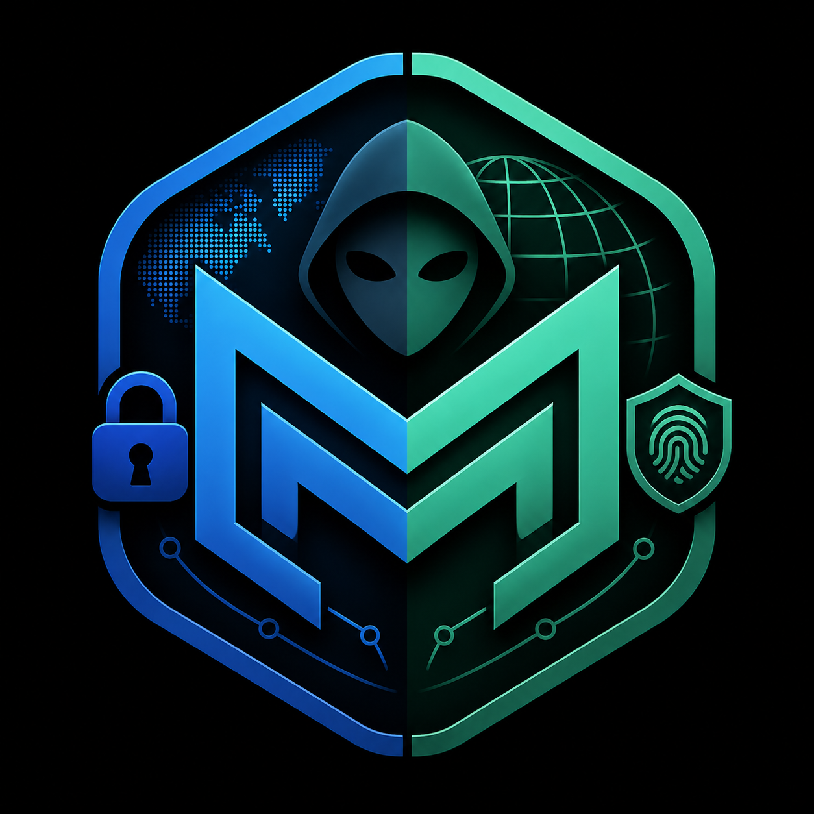

<div align="center">
  
  
  # Mirage
  **Linux Identity Virtualization & Audit Platform**
</div>

---

**Mirage** lets a user audit and project a consistent virtual identity (location, time, locale, network, hardware IDs) to applications running in an isolated sandbox, without altering the host system. It exists for: personal privacy, security/privacy research, and testing how software behaves under different locale/geo/network conditions.

> **Disclaimer & Ethics**  
> Mirage is explicitly NOT for: evading platform bans, creating multiple accounts on a single service (sybil/multi-accounting), defeating fraud-detection or KYC systems, circumventing regional pricing/licensing restrictions, or impersonating a specific real third party. Do not build features whose primary value is defeating a third-party service's anti-abuse system.

---

## Comprehensive Features

Mirage provides absolute control over the signals your sandbox exposes to the world. It includes features from all developmental phases:

### Core Sandboxing & Network
- **Bubblewrap (`bwrap`) Sandboxing:** Fast, unprivileged, file-system isolation. The host system is mounted read-only, with a dedicated `tmpfs` overlay for mutable mock files.
- **Network Namespace Isolation (`mirage-netns`):** Creates an entirely isolated network namespace using `veth` pairs and `iptables` NAT bridging. Completely disables IPv6 in the sandbox to prevent accidental dual-stack leaks.
- **Abstract Unix Socket Isolation:** `--unshare-net` is always applied, placing the sandbox in its own network namespace. Because abstract Unix domain sockets (`\0`-prefixed names) are scoped per network namespace in Linux, the host's abstract D-Bus session socket is completely invisible inside the sandbox. This closes the primary bypass path for D-Bus proxy evasion.
- **DNS Spoofing:** Overrides `/etc/resolv.conf` to force specific DNS resolvers (e.g., stopping ISP DNS leaks).

### Deep Identity Spoofing
- **Full D-Bus Identity Interception (`mirage-dbus-proxy`):** A private `dbus-daemon` is started for every sandbox session. It intercepts all major freedesktop system services that leak host identity:
  - `org.freedesktop.hostname1` — returns the profile hostname, machine-id, chassis type, and hardware model.
  - `org.freedesktop.timedate1` — returns the profile timezone. Wall-clock time is not faked (see `docs/dbus-proxy.md`).
  - `org.freedesktop.locale1` — returns the full `LANG`/`LC_TIME`/`LC_NUMERIC` locale combo.
  - `org.freedesktop.login1` — `ListSessions` and `ListUsers` return empty lists. Power management and inhibitor locks are not intercepted.
  - `org.freedesktop.Accounts` — fully blocked; returns `AccessDenied` for all calls.
  - `org.freedesktop.UPower` — device model and serial number strings stripped. Battery percentage and charge state are not faked.
  - `org.freedesktop.GeoClue2` — GPS latitude, longitude, and accuracy are spoofed from the profile's `gps` field.
- **`DBUS_SESSION_BUS_ADDRESS` / `DBUS_SYSTEM_BUS_ADDRESS` override:** Both environment variables are explicitly set inside the sandbox to point to the proxy socket, preventing libraries from connecting to the host's abstract socket path directly.
- **Hardware & System ID Spoofing:** Mounts fake `/etc/machine-id`, `/etc/hostname`, and `/proc/cpuinfo`. Spoofs MAC addresses over `/sys/class/net/eth0` using realistic OUIs.
- **Timezone & Locale Overrides:** Dynamically binds `/usr/share/zoneinfo`, `/etc/localtime`, and `/etc/timezone`. Injects `LANG` and `LC_ALL` environments to emulate regional OS environments.

### Profile Diversity Engine
- **Anti-Fingerprinting:** When you generate a profile, Mirage doesn't use hardcoded default values. It uses statistical models to generate realistic device signals.
- **Region-Weighted Generation:** Generates culturally accurate hostnames, Git personas (e.g., regional email providers), OS-specific screen resolutions, and font bundles based on the profile's target region.
- **Persistent Stability:** Values like UUID4 `machine-id` are saved to the profile database and *never* re-rolled, ensuring your virtual machine "ages" naturally just like a real computer.

### Audit & Consistency Tools
- **Consistency Engine:** A multi-rule engine that runs consistency checks before you launch (e.g., "Does my WebRTC public IP match my system IPv4?").
- **R17 Homogeneity Check:** Mirage audits its own generated profiles to warn you if your profile looks "too generic" (e.g., exactly 1920x1080 + 10 fonts + fresh machine ID).
- **Session Boundary Leak Audit:** (`mirage audit --session`) A procedural `/proc` parsing engine that verifies you aren't accidentally establishing concurrent TCP connections on the host while interacting via the sandbox.

### Shells & Dashboards
- **Interactive Session Shell (`mirage shell --tmux`):** Drops you into a sandboxed bash prompt. The built-in `tmux` integration guarantees that any new panes or windows you open inherit the exact same isolated Linux namespace.
- **TUI Dashboard:** A terminal-based user interface to monitor active spoofed signals, loaded plugins, and available profiles.
- **Tauri React GUI:** A graphical interface for less technical users to oversee their audit graph and session statuses.
- **C ABI Plugin Host:** Extend Mirage with your own compiled `.so` plugins to inject entirely custom signal spoofing logic.

---

## Setup & Installation

### Step 1: Install System Dependencies
Mirage relies on standard Linux namespace and sandbox tools. Open your terminal and install them:

**Debian/Ubuntu / Linux Mint:**
```bash
sudo apt update
sudo apt install bubblewrap iproute2 tmux dbus pkg-config libssl-dev gcc
```

**Fedora:**
```bash
sudo dnf install bubblewrap iproute2 tmux dbus-daemon pkgconf-pkg-config openssl-devel gcc
```

**Arch Linux:**
```bash
sudo pacman -S bubblewrap iproute2 tmux dbus pkgconf openssl gcc
```

### Step 2: Install Rust
Mirage is built in Rust. If you don't have Rust installed, run the official installer:
```bash
curl --proto '=https' --tlsv1.2 -sSf https://sh.rustup.rs | sh
```
*(Restart your terminal or run `source $HOME/.cargo/env` after this finishes.)*

### Step 3: Build Mirage
Clone this repository (or open the folder) and build it:
```bash
# Go to the Mirage folder
cd /path/to/Mirage

# Build the entire workspace
cargo build --release
```

Once done, the compiled binaries will be located in the `target/release/` folder.

---

## Usage Guide

### 1. Run a single application
Want to run `bash` or `firefox` inside your `london-vpn` profile?
```bash
./target/release/mirage-cli run bash --profile profiles/london-vpn.yaml
```

### 2. Start a Persistent Session Shell (Recommended)
If you want to open multiple terminal tabs inside the same sandbox, the safest way is using the built-in `tmux` integration:
```bash
./target/release/mirage-cli shell --profile profiles/london-vpn.yaml --tmux
```
Once inside, you can use `Ctrl+B %` or `Ctrl+B "` to split panes without breaking out of the sandbox.
> **Note on Terminal Emulators:** If you simply click "New Tab" on your GUI terminal emulator (like GNOME Terminal), the new tab will open on your primary host system, not within the sandbox. **Always use the `--tmux` option for multitasking.**

### 3. Open the TUI Dashboard
Explore your profiles, plugins, and configuration via the terminal UI:
```bash
./target/release/mirage-tui
```

### 4. Open the GUI Dashboard (Tauri + React)
If you prefer a graphical interface, you can launch the Mirage GUI app. It requires Node.js/npm and a few GTK system libraries (Tauri uses the system's WebKit2GTK engine instead of bundling a browser).

**Install Tauri system dependencies first (Debian/Ubuntu/Kali):**
```bash
sudo apt install -y libwebkit2gtk-4.1-dev libjavascriptcoregtk-4.1-dev libsoup-3.0-dev libayatana-appindicator3-dev librsvg2-dev
```

**Fedora:**
```bash
sudo dnf install webkit2gtk4.0-devel libsoup-devel gtk3-devel librsvg2-devel
```

Then launch the GUI:
```bash
# Go to the GUI folder
cd gui

# Install the Node dependencies
npm install

# Run the Tauri application in development mode
npm run tauri dev
```

### 5. Audit Your Setup
Verify you aren't leaking connections across your sandbox boundary:
```bash
./target/release/mirage-cli audit --session
```

---

## Debugging, Fixes & FAQs

### Q: I'm getting `bwrap: No permissions to try setuid bwrap` or namespace errors.
**Fix:** Some Linux distributions (like Debian/Ubuntu) restrict user namespaces. You can temporarily enable them by running:
```bash
sudo sysctl -w kernel.unprivileged_userns_clone=1
```

### Q: Network isolation isn't working (`ip netns` errors).
**Fix:** If your profile has `isolate_network: true`, Mirage needs to create a new network namespace. This requires `sudo` privileges for the `ip netns` command. Mirage will automatically invoke `sudo`, so you may be prompted for your password. Ensure `iproute2` is installed.

### Q: Why do my fonts or screen resolutions look normal but the audit tool (`R17`) gives an informational warning?
**Fix:** Mirage runs a **Consistency Checker** that audits its own output. If it sees you generated a profile with fewer than 12 fonts, or a highly generic hostname and fresh MAC, it warns you that you might look machine-generated. To resolve this, create a new profile—the **Profile Diversity Engine** will automatically generate realistic statistics for you.

### Q: Where do I put my profiles?
**Fix:** Profiles are YAML files stored in the `profiles/` directory. You can create as many as you require (e.g., `profiles/tokyo.yaml`). A basic profile looks like this:
```yaml
name: "london-vpn"
timezone: "Europe/London"
locale: "en_GB.UTF-8"
hostname: "dev-workstation"
isolate_network: true
```

### Q: How do plugins work?
**Fix:** Plugins are shared libraries (`.so` files) that implement the `MiragePluginVtable` C-ABI. Place them in `~/.config/mirage/plugins/` (or the default system locations) and the `PluginHost` will automatically discover and load them when running a sandbox.

### Q: An app inside the sandbox is still seeing my real hostname or locale via D-Bus.
**Fix:** This means the app is querying `org.freedesktop.hostname1` or `org.freedesktop.locale1` via D-Bus. Mirage intercepts both of these interfaces by default since the D-Bus hardening update. Confirm that `dbus-daemon` is installed and that the proxy started successfully — look for the `[mirage-dbus-proxy] Fake D-Bus system bus is live` message in the launch output. If it is missing, install `dbus`: `sudo apt install dbus`.

### Q: What is `DBUS_SESSION_BUS_ADDRESS` and why does Mirage override it?
**Fix:** `DBUS_SESSION_BUS_ADDRESS` tells applications where to find the D-Bus session daemon. On a normal Linux desktop, this points to an abstract Unix socket on the host (e.g. `unix:abstract=dbus-xyz`). Abstract sockets are not on the filesystem and bypass the bwrap overlay. Mirage overrides this variable inside the sandbox to point to its own private proxy socket, and simultaneously uses `--unshare-net` to make the host's abstract sockets invisible. Both layers together guarantee that D-Bus queries reach the proxy.

### Q: An application needs real `login1` session data and is broken inside the sandbox.
**Fix:** `mirage-dbus-proxy` returns empty lists for `ListSessions` and `ListUsers` to prevent identity leakage. Power management and inhibitor locks are not intercepted. If a specific application requires its own session information to function, this is a known trade-off. Consider running that application outside the sandbox or filing an issue describing the use case.
